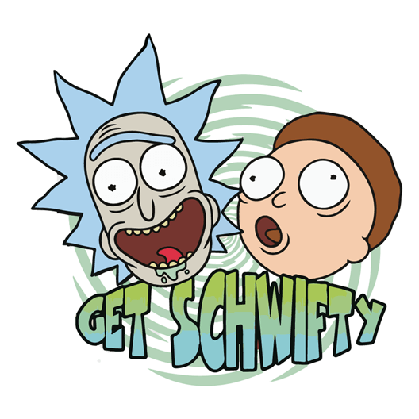

<!--hide-->
#  Rick & Morty BlogWars Reading List
<!--endhide-->

  

## 📝 Purpose

Create a React webapp that lists the Characters, Locations and Episodes schemas provided by the Rick & Morty API.

1. Need to have 2 views:
	- home.js to list all data (Characters, Locations or Episodes)
	- single.js to show more info from individual

2. Read Later or Favorites functionality
	- Implement a "Read Later" functionality, i.e, a button that allows the user to "save" the item (character, location or episode) into a special list. This list will be shown at the top of the home page, it resembles the main list but only shows the "saved" elements.

3. Use the Context
	- To ensure that the user can "save" the item, you must implement an action that can be accessible from anywhere within the app.

# 😎 Feeling Confident
- Prevent the website from fetching the Startwars API again if refreshed (you can use the localstorage to save the store on the local browser).
- Implemented a search bar that gives suggestions for the data showing in home page while typing in it. When a suggestion is clicked it shows only that specific schema (character, location or episode) selected.

# 🔥 Bonus
- Option in search bar to not show the suggestions
- Favorites are also saved in localStorage

# 👨‍💻 Technologies
- HTML
- CSS
- Bootstrap
- React
- Flux

# 👥 Contributors
This and many other projects are built by students as part of the 4Geeks Academy [Coding Bootcamp](https://4geeksacademy.com/us/coding-bootcamp) by [Alejandro Sanchez](https://twitter.com/alesanchezr) and many other contributors. Find out more about our [Full Stack Developer Course](https://4geeksacademy.com/us/coding-bootcamps/part-time-full-stack-developer), and [Data Science Bootcamp](https://4geeksacademy.com/us/coding-bootcamps/datascience-machine-learning).